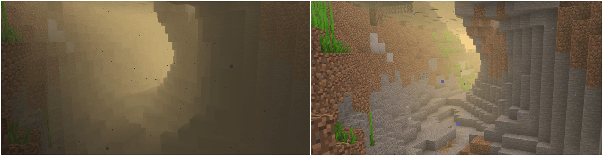
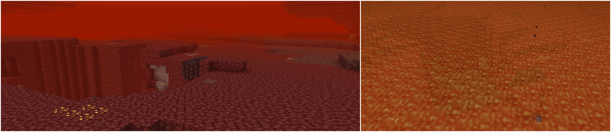
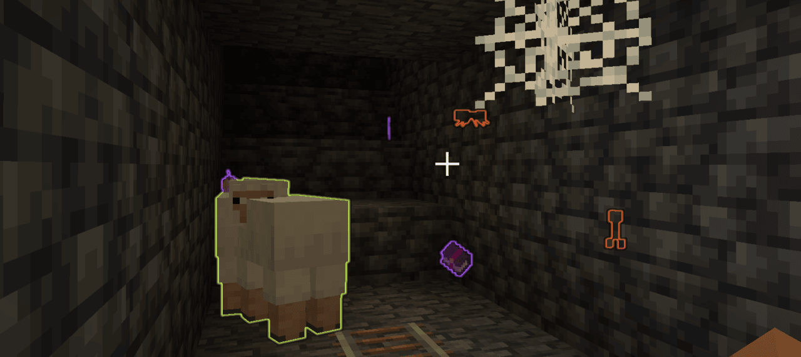
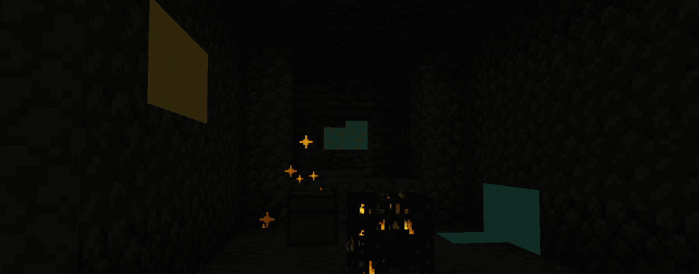

# FAQ
- 1.19.2 documentation can be found [here](https://github.com/SiverDX/additional_enchantments/blob/1.19.2/README.md)
- 1.20.1 documentation can be found [here](https://github.com/SiverDX/additional_enchantments/blob/1.20.1/README.md)
 
Further enchantments are planned
  - Homing
  - Hunter
  - Confusion (maybe)
  - Voiding (maybe)
  - Straight Shot (maybe)
  - ...?

<details>
<summary>General Technical Definitions</summary>

New trigger point for enchantment effects
- `equipment_change_trigger`: When changing any equipped item

New loot item conditions
- `entity_type`
- `match_item_entity`

<details>
<summary>Entity Type</summary>

Allows broader checks for entities

EntityType (LootItemCondition)
```js
{
  "type": Type,           // [Mandatory] || 
  "entity": EntityTarget  // [Mandatory] || Which entity of the loot context is checked
}
```

Type
- `living_entity`: Entities that extend the `LivingEntity` class (i.e., no `Minecarts`, `Items` etc.)
- `enemy`: Entities that implement the `Enemy` interface or are of the mob category `MONSTER`
- `tamed`: Entities that extend the `TamableAnimal` class and are tamed
- `animal`: Entities that extend the `Animal` class
- `item`: Entities that extend the `ItemEntity` class
- `experience_orb`: Entities that extend the `ExperienceOrb` class

EntityTarget
- `this`
- `attacker`
- `direct_attacker`
- `attacking_player`

</details>

<details>
<summary>Match Item Entity</summary>

Allows using `ItemPredicates` to check the item of the `Item Entity` 

```js
{
  "predicate": ItemPredicate, // [Optional] || To match the item of the item entity, all are valid if left empty
  "target": EntityTarget      // [Optional] || Which entity of the loot context is checked (Default: 'this')
}
```

Additional explanations
- ItemPredicate: Check the `predicate` definition of [match_tool](https://minecraft.wiki/w/Predicate)

EntityTarget
- `this`
- `attacker`
- `direct_attacker`
- `attacking_player`

</details>

</details>

# Enchantments
## Fluid Vision
- Improves visibility through fluids from above
- Improves visibility while within the fluids





<details>
<summary>Default Effects</summary>

Level 1:
- Improves visibility in water

Level 2:
- Improves visibility in lava
- Improves visibility in `create` fluids (`#additional_enchantments:create` fluid type tag)
- Improves visibility in `the_bumblezone` fluids (`#additional_enchantments:bumblezone` fluid type tag)
- Better visibility

Level 3:
- Better visibility

Level 4:
- Better visibility

</details>

<details>
<summary>Technical Definition</summary>

```js
{
  "vision": {                                     // [Mandatory] || 
    "values": [                                   // [Mandatory] || 
      {
        "level_range": {                          // [Mandatory] || Defines at which enchantment levels this effect will apply
          "min": integer,                         // [Optional]  || 
          "max": integer                          // [Optional]  || 
        },
        "value": [                                // [Mandatory] || 
          {
            "id": ResourceLocation,               // [Mandatory] || Unique identifier for the effect
            "fluid_types": HolderSet<FluidType>,  // [Mandatory] || Defines to which fluids this effect will apply to 
            "percentage": LevelBasedValue         // [Mandatory] || Defines how see-through the fluid will be and by how much the viewing distance within the fluid will be improved
          }
        ]
      }
    ]
  }
}
```

Additional explanations
- [ResourceLocation](https://minecraft.wiki/w/Identifier)
- [HolderSet](https://developers.wiki.resourcefulbees.com/miscellaneous-data)
- [LevelBasedValue](https://minecraft.wiki/w/Enchantment_definition#Level-based_value)

</details>

## Perception
- Displays entities as glowing using custom colors, see below to which entities are affected by default



<details>
<summary>Default Effects</summary>

Level 1:
- Highlights valuable items (`#additional_enchantments:valuables` item tag)
- Highlights enchanted items
- Highlights enemies
- Highlights animals

Level 2:
- Highlights valuable items (`#additional_enchantments:valuables` item tag)
- Highlights enchanted items
- Highlights enemies
- Highlights animals
- Highlights bosses

Level 3:
- Highlights valuable items in a limited form (`#additional_enchantments:limited_valuables` item tag)
- Highlights enchanted books containing useful enchantments (e.g., `Unbreaking II` or `Mending`)
- Highlights enemies
- Highlights animals
- Highlights bosses

</details>

<details>
<summary>Technical Definition</summary>

```js
{
  "perception": {                           // [Mandatory] ||  
    "values": [                             // [Mandatory] || 
      {
        "level_range": {                    // [Mandatory] || Defines at which enchantment levels this effect will apply
          "min": integer,                   // [Optional]  || 
          "max": integer                    // [Optional]  || 
        },
        "value": [                          // [Mandatory] || 
          {
            "key": ResourceLocation,        // [Mandatory] || Unique identifier for the effect
            "condition": LootItemCondition, // [Mandatory] || Checks which entities this effect will apply to
            "range": LevelBasedValue,       // [Mandatory] || Defines up to which distance the entities will be affected at
            "color": ShiftingColor          // [Mandatory] || The colors of the effect
          }
        ]
      }
    ]
  }
}
```

ShiftingColor
```js
{
  "colors": [                 // [Mandatory] || The colors defined in here will be smoothly cycled through based on the specified shift rate 
    {
      "color": TextColor,     // [Mandatory] || 
      "alpha": float          // [Optional]  || The alpha value of the color (0..1) (Default: 1)
    }
  ],
  "color_shift_rate": double, // [Optional]  || At which speed the colors will be cycled through (Default: 1.0)
  "priority": integer         // [Optional]  || Which color to be picked - the entry with the highest priority will be picked (Default: 0)
}
```

Additional explanations
- TextColor: Either a named minecraft color or Hex codes
- [ResourceLocation](https://minecraft.wiki/w/Identifier)
- [LootItemCondition](https://docs.neoforged.net/docs/1.21.1/resources/server/loottables/lootconditions)
- [LevelBasedValue](https://minecraft.wiki/w/Enchantment_definition#Level-based_value)

</details>

## Treasure Finder
- Will highlight blocks using different ways, see below for more information



(Compression combined with a still image makes this look worse than it actually is)

<details>
<summary>Default Effects</summary>

All levels:
- `treasures`, using the `particles` display type

Level 1:
- (Uses `simple_shader` for all ores)
- Copper ore
- Iron ore
- Zinc ore
- Silver ore

Level 2:
- (Uses `simple_shader` for all ores)
- Iron ore
- Zinc ore
- Silver ore
- Lapis ore
- Gold ore

Level 3:
- (Uses `simple_shader` for all ores)
- Lapis ore
- Gold ore
- Emerald ore
- Diamond ore

Level 4:
- (Uses `outline` for all ores)
- Emerald ore
- Diamond ore
- Netherite ore

</details>

<details>
<summary>Technical Definition</summary>

```js
{
  "vision": {                             // [Mandatory] || 
    "values": [                           // [Mandatory] || 
      {
        "level_range": {                  // [Mandatory] || Defines at which enchantment levels this effect will apply
          "min": integer,                 // [Optional]  || 
          "max": integer                  // [Optional]  || 
        },
        "value": [                        // [Mandatory] || 
          {
            "id": ResourceLocation,       // [Mandatory] || Unique identifier for the effect
            "blocks": BlockDefinition,    // [Mandatory] || Defines to which blocks this effect will apply to
            "range": LevelBasedValue,     // [Mandatory] || Defines up to which distance the blocks will be affected at
            "display_type": DisplayType,  // [Mandatory] || Defines how the effect will be displayed
            "particle_rate": integer,     // [Optional]  || The rate at which particles will be spawned (only applicable to 'particles' display type) (Default: 0)
            "color": ShiftingColor        // [Mandatory] || The colors of the effect
          }
        ]
      }
    ]
  }
}
```

ShiftingColor
```js
{
  "colors": [                 // [Mandatory] || The colors defined in here will be smoothly cycled through based on the specified shift rate 
    {
      "color": TextColor,     // [Mandatory] || 
      "alpha": float          // [Optional]  || The alpha value of the color (0..1) (Default: 1)
    }
  ],
  "color_shift_rate": double, // [Optional]  || At which speed the colors will be cycled through (Default: 1.0)
  "priority": integer         // [Optional]  || Which color to be picked - the entry with the highest priority will be picked (Default: 0)
}
```

Additional explanations
- BlockDefinition allows either one of these two
  - `treasures`: Unopened loot containers (included in `additional_enchantment:treasures` block tag)
  - HolderSet of type `Block`
- DisplayType
  - `outline`: Outline around the block, visible through walls
  - `particles`: Spawns particles at the block position
  - `simple_shader`: A glow effect around the block
- TextColor: Either a named minecraft color or Hex codes 
- [ResourceLocation](https://minecraft.wiki/w/Identifier)
- [HolderSet](https://developers.wiki.resourcefulbees.com/miscellaneous-data)
- [LevelBasedValue](https://minecraft.wiki/w/Enchantment_definition#Level-based_value)

</details>

## Climbing
- Allows climbing on most blocks, no ladder required
- At further levels also disables the automatic sliding down and even allows climbing on ceilings

<details>
<summary>Default Effects</summary>

Level 1:
- Allows climbing if the block matches:
  - Is not air
  - Is solid
  - Is not a fluid
  - Is not `#additional_enchantments:slippery` (ice / glass)

Level 2:
- Enables sticking to walls

Level 3:
- Enables ceiling climbing

</details>

<details>
<summary>Technical Definition</summary>

```js
{
  "climbable": {                            // [Mandatory] || 
    "values": [                             // [Mandatory] || 
      {
        "level_range": {                    // [Mandatory] || Defines at which enchantment levels this effect will apply
          "min": integer,                   // [Optional]  || 
          "max": integer                    // [Optional]  || 
        },
        "value": [                          // [Mandatory] || 
          {
            "key": ResourceLocation,        // [Mandatory] || Unique identifier for the effect
            "blocks": BlockPredicate,       // [Mandatory] || Defines which blocks are climbable
            "can_stick_to_walls": boolean,  // [Optional]  || If enabled the entity will not automatically slide down the wall (press SHIFT to be able to climb downwards)
            "can_climb_ceilings": boolean   // [Optional]  || If enabled the entity will be able to climb along the ceiling 
          }
        ]
      }
    ]
  }
}
```

Additional explanations
- [ResourceLocation](https://minecraft.wiki/w/Identifier)
- [BlockPredicate](https://minecraft.wiki/w/Block_predicate)

</details>

## Green Foot
- Applies a bonemeal effect on the blocks you walk on and around you
- For saplings and crops the effect will also damage the enchanted item per application

<details>
<summary>Default Effects</summary>

Level 1:
- Any block: Constant 1% chance
- `#minecraft:saplings`: 10% chance, + 7.5% chance per level
- `#minecraft:crops`: 30% chance, + 10% chance per level

Level 2:
- Increased range
- Increased probability

Level 3:
- Increased range
- Increased probability

</details>

<details>
<summary>Technical Definition</summary>

```js
{
  "growth_entries": [                 // [Mandatory] ||  
    {
      "predicate": BlockPredicate,    // [Mandatory] || Checks which block to apply this effect to 
      "probability": LevelBasedValue, // [Mandatory] || The chance for this effect to be applied, checked separately before each attempt for every position
      "priority": integer,            // [Mandatory] || Which effect to pick if multiple predicates match - the highest priority is selected
      "damage": integer               // [Mandatory] || The amount the enchanted item will be damaged from each successful effect attempt 
    }
  ],
  "extra_range": LevelBasedValue      // [Mandatory] || The extra range (radius) around the player this effect will apply to, in addition to the origin position 
}
```

Additional explanations
- [BlockPredicate](https://minecraft.wiki/w/Block_predicate)
- [LevelBasedValue](https://minecraft.wiki/w/Enchantment_definition#Level-based_value)

</details>